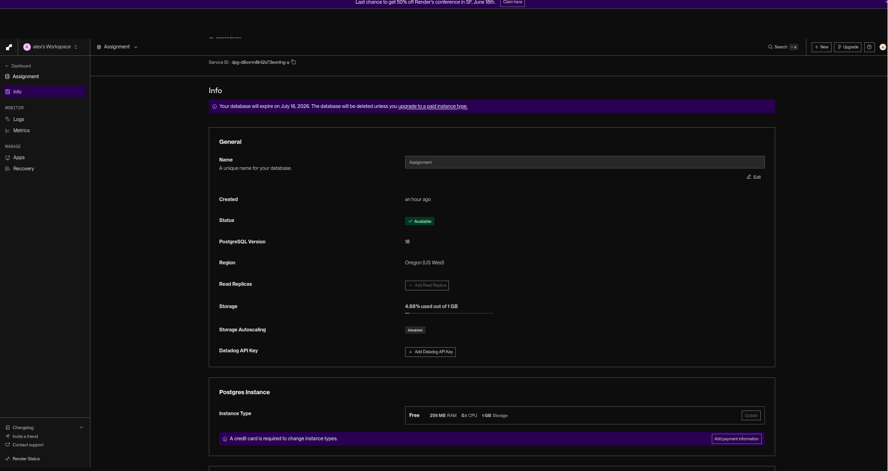
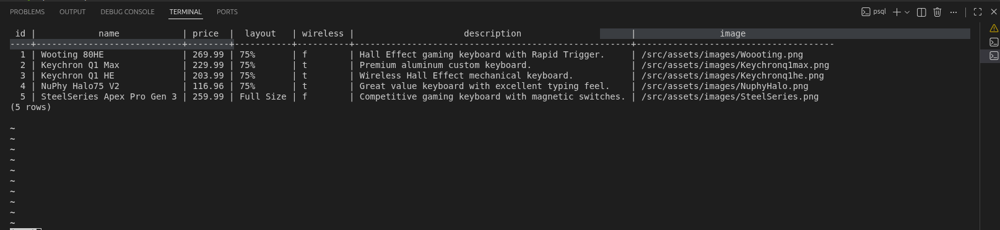

# WEB103 Project 2 - *Top 5 Keyboards 2026*

Submitted by: **Alexander Pulido**

About this web app: **A listicle web app that ranks the top 5 mechanical keyboards of 2026. The list items are stored in a Render-hosted PostgreSQL database, and the vanilla HTML/CSS/JavaScript frontend fetches them from an Express backend. Each keyboard has its own detail page, and users can search the list by keyboard name.**

Time spent: **6** hours

## Required Features

The following **required** functionality is completed:

<!-- Make sure to check off completed functionality below -->
- [x] **The web app uses only HTML, CSS, and JavaScript without a frontend framework**
- [x] **The web app is connected to a PostgreSQL database, with an appropriately structured database table for the list items**
  - [x] **NOTE: Your walkthrough added to the README must include a view of your Render dashboard demonstrating that your Postgres database is available**
  - [x]  **NOTE: Your walkthrough added to the README must include a demonstration of your table contents. Use the psql command 'SELECT * FROM tablename;' to display your table contents.**


The following **optional** features are implemented:

- [x] The user can search for items by a specific attribute
  - Users can search keyboards by name from the home page. The query is sent to the backend and the filtering is done in the database with a `name ILIKE` query (the API also supports filtering by `layout` and `wireless`).

The following **additional** features are implemented:

- [x] Each keyboard has its own server-rendered detail page (`/keyboard/:id`) showing price, layout, wireless support, and description, all pulled from the database.
- [x] An `npm run reset` script that creates the table schema and seeds it from a single source of data.

## Video Walkthrough

[Watch the Video Walkthrough](https://imgur.com/a/EZVoJRc)

<!-- Replace this with whatever GIF tool you used! -->
GIF created with peek
<!-- Recommended tools:

[peek](https://github.com/phw/peek) for Linux. -->

### Render dashboard (Postgres database is available)

<!-- TODO: Replace with a screenshot of your Render dashboard showing the
     PostgreSQL instance with an "Available" status. -->


### Table contents (`SELECT * FROM keyboards;`)

<!-- TODO: Replace with a screenshot of your psql session running the query
     below against your Render database. -->
```sql
SELECT * FROM keyboards;
```



```
codepath-web103/
├── client/                     # Frontend (no framework)
│   ├── index.html
│   └── src/
│       ├── assets/images/      # Keyboard images
│       ├── css/style.css
│       └── services/script.js  # Fetches data from the backend
└── server/                     # Backend (Express + PostgreSQL)
    ├── server.js               # App entry point, serves the client + routes
    ├── config/
    │   ├── database.js         # PostgreSQL connection pool (pg)
    │   ├── data.js             # Seed data for the keyboards table
    │   └── reset.js            # Creates + seeds the keyboards table
    └── routes/
        └── keyboards.js        # /keyboard API and detail routes
```

## Database Schema if needed

The `keyboards` table:

| Column      | Type            | Notes                  |
| ----------- | --------------- | ---------------------- |
| id          | SERIAL          | Primary key            |
| name        | VARCHAR(255)    | NOT NULL               |
| price       | NUMERIC(10, 2)  | NOT NULL               |
| layout      | VARCHAR(50)     |                        |
| wireless    | BOOLEAN         | NOT NULL DEFAULT false |
| description | TEXT            |                        |
| image       | VARCHAR(255)    |                        |


1. Create a PostgreSQL database on [Render](https://render.com/).
2. In the `server/` folder, copy `.env.example` to `.env` and fill in the
   connection details from your Render database's info page:
   ```
   PGUSER=...
   PGPASSWORD=...
   PGHOST=...
   PGPORT=5432
   PGDATABASE=...
   ```
3. Install dependencies and seed the database:
   ```bash
   cd server
   npm install
   npm run reset    # creates the keyboards table and seeds it
   ```
4. Start the server:
   ```bash
   npm start
   ```
5. Open [http://localhost:3000](http://localhost:3000).

## Notes


## License

Copyright 2026 Alexander Pulido

Licensed under the Apache License, Version 2.0 (the "License"); you may not use this file except in compliance with the License. You may obtain a copy of the License at

> http://www.apache.org/licenses/LICENSE-2.0

Unless required by applicable law or agreed to in writing, software distributed under the License is distributed on an "AS IS" BASIS, WITHOUT WARRANTIES OR CONDITIONS OF ANY KIND, either express or implied. See the License for the specific language governing permissions and limitations under the License.
